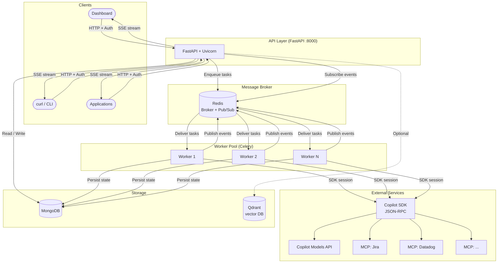

<p align="center">

```
████████╗██████╗ ██████╗      █████╗  ██████╗ ███████╗███╗   ██╗████████╗
╚══██╔══╝██╔══██╗██╔══██╗    ██╔══██╗██╔════╝ ██╔════╝████╗  ██║╚══██╔══╝
   ██║   ██████╔╝██║  ██║    ███████║██║  ███╗█████╗  ██╔██╗ ██║   ██║
   ██║   ██╔══██╗██║  ██║    ██╔══██║██║   ██║██╔══╝  ██║╚██╗██║   ██║
   ██║   ██████╔╝██████╔╝    ██║  ██║╚██████╔╝███████╗██║ ╚████║   ██║
   ╚═╝   ╚═════╝ ╚═════╝     ╚═╝  ╚═╝ ╚═════╝ ╚══════╝╚═╝  ╚═══╝   ╚═╝
```

</p>

<p align="center">
  <em>▓▓ Your agents. Your rules. Your infrastructure. ▓▓</em><br>
  <sub>⬛⬜⬛⬜⬛⬜⬛⬜⬛⬜⬛⬜⬛⬜⬛⬜⬛⬜⬛⬜⬛⬜⬛⬜⬛⬜⬛⬜⬛⬜⬛⬜⬛⬜⬛⬜⬛⬜</sub>
</p>

<p align="center">
  ⚡ Built by <a href="https://www.naaico.com"><strong>NAAICO</strong></a> ⚡
</p>

<p align="center">
  <a href="https://www.apache.org/licenses/LICENSE-2.0"></a>
  
  
  <a href="https://github.com/naaico-tech/tbd-agents/pkgs/container/tbd-agents"></a>
  
  
  
  
  
  <a href="https://github.com/naaico-tech/tbd-agents/releases"></a>
  <a href="https://github.com/naaico-tech/tbd-agents/pkgs/container/tbd-agents"></a>
</p>

---

> 🎮 **TBD** — *To Be Decided* by you: what your agents do, which tools they use, and how far they go.

Build, control, and trigger custom AI agents over the web — no black boxes, no vendor lock-in. A clean REST API backed by the GitHub Copilot SDK that runs entirely on **your** infrastructure.

<p align="center">
  <!-- Replace the src below with your actual demo GIF once recorded -->
  
  <br>
  <sub><em>↑ Record a demo and drop the GIF at <code>docs/demo.gif</code> to show it here</em></sub>
</p>

---

## ★ Highlights

<table>
<tr>
<td width="50%">

🏠 **Fully self-hosted**<br>Runs on your infra via Docker Compose; no SaaS dependency beyond GitHub Copilot billing.

⚡ **Real-time streaming**<br>SSE endpoint streams logs, messages, token-by-token responses, and usage metrics live to any client.

🔧 **MCP tool ecosystem**<br>Connect any MCP-compatible tool server (Datadog, Jira, Notion, Slack, and hundreds more) via stdio or SSE.

📊 **Usage & cost tracking**<br>Per-workflow token counts, premium request quotas, and cost data from the Copilot SDK.

📤 **Output destinations**<br>Agents autonomously push results to Notion pages or Slack channels.

</td>
<td width="50%">

🤖 **Custom agents over HTTP**<br>Create, configure, and trigger agents with a simple REST API or the built-in dashboard.

🔀 **Distributed workers**<br>Celery + Redis architecture lets you scale agent execution horizontally; add workers to handle load.

♾️ **Infinite sessions**<br>Automatic context compaction keeps long-running agents alive without hitting context limits.

🧩 **Skills system**<br>Modular instruction sets that can be installed per workflow to shape agent behaviour.

📚 **Knowledge bases**<br>Attach Qdrant vector DBs or upload files/text tagged for retrieval; agents pull relevant knowledge automatically.

📦 **Import/Export**<br>Export and import Skills, Agents, Workflows, and Knowledge Bases as JSON bundles for backup or cross-environment migration.

🧩 **Plugin system**<br>Extend TBD Agents with custom Python plugins registered via a YAML registry. Loaded at startup via `PluginBase`.

</td>
</tr>
</table>

---

## 🚀 Quick Start

### Option A — Pull pre-built image (recommended for production)

```bash
# Pull the latest release
docker pull ghcr.io/naaico-tech/tbd-agents:latest

# Or pin to a specific version
docker pull ghcr.io/naaico-tech/tbd-agents:v0.1.0

# Start all services using the pre-built image
cp .env.example .env   # fill in GITHUB_TOKEN etc.
docker compose up
```

### Option B — Build from source (for development)

```bash
git clone https://github.com/naaico-tech/tbd-agents.git
cd tbd-agents
cp .env.example .env
docker compose up --build
```

Your GitHub PAT needs the `copilot` scope — [create one here](https://github.com/settings/tokens).

| URL | Description |
|---|---|
| `http://localhost:8000/dashboard` | Legacy UI |
| `http://localhost:8000/dashboard-new-ui` | New Flutter UI |
| `http://localhost:8000/docs` | Swagger / API docs |
| `http://localhost:8000/api` | API base path |

See [docs/getting-started/local-setup.md](docs/getting-started/local-setup.md) for detailed local development instructions.

---

## 📖 Documentation

| Document | Description |
|---|---|
| [Local Setup](docs/getting-started/local-setup.md) | Prerequisites, Docker and bare-metal setup, environment variables |
| [Architecture](docs/architecture.md) | System design, distributed worker flow, Redis event bus, data model |
| [Features](docs/features.md) | Deep dive into agents, MCP, skills, streaming, infinite sessions, and more |
| [Contributing](CONTRIBUTING.md) | How to contribute: setup, coding standards, PR guidelines |

---

## 🏗️ Architecture



---

## 🔌 API Reference

> All endpoints (except `/health`) require `Authorization: Bearer <GITHUB_TOKEN>` header.

### ♥ Health

```
GET /health
```

### 🤖 Agents

```
POST   /api/agents              ← Create agent
GET    /api/agents              ← List agents
GET    /api/agents/{id}         ← Get agent
PUT    /api/agents/{id}         ← Update agent
DELETE /api/agents/{id}         ← Delete agent
```

### 🧩 Skills

```
POST   /api/skills              ← Create skill
GET    /api/skills              ← List skills
GET    /api/skills/{id}         ← Get skill
PUT    /api/skills/{id}         ← Update skill
DELETE /api/skills/{id}         ← Delete skill
```

### 🔧 MCP Servers

```
POST   /api/mcps                ← Register MCP server
GET    /api/mcps                ← List MCP servers
GET    /api/mcps/{id}           ← Get MCP server
POST   /api/mcps/{id}/test      ← Test MCP connection
GET    /api/mcps/{id}/tools     ← List tools from MCP server
DELETE /api/mcps/{id}           ← Remove MCP server
```

### 📚 Knowledge Sources

```
POST   /api/knowledge-sources              ← Register knowledge source (vector_db or mongo_db)
GET    /api/knowledge-sources              ← List sources (optional ?tags= filter)
GET    /api/knowledge-sources/{id}         ← Get source
PUT    /api/knowledge-sources/{id}         ← Update source
DELETE /api/knowledge-sources/{id}         ← Delete source (cascade-deletes items)
POST   /api/knowledge-sources/{id}/test    ← Test connection
```

### 📄 Knowledge Items

```
POST   /api/knowledge-items                ← Create text knowledge item
POST   /api/knowledge-items/upload         ← Upload file/image (multipart)
GET    /api/knowledge-items                ← List items (?source_id=, ?tags=, ?content_type=)
GET    /api/knowledge-items/{id}           ← Get item metadata
GET    /api/knowledge-items/{id}/content   ← Download file content
PUT    /api/knowledge-items/{id}           ← Update item tags/metadata
DELETE /api/knowledge-items/{id}           ← Delete item
POST   /api/knowledge-items/query          ← Query items by tags
```

### ⚙️ Workflows

```
POST   /api/workflows                        ← Create workflow
POST   /api/workflows/{id}/prompt            ← Send prompt (returns 201, runs via worker)
GET    /api/workflows/{id}                   ← Get workflow state + logs + messages
GET    /api/workflows/{id}/stream            ← SSE stream of real-time events
GET    /api/workflows                        ← List your workflows
POST   /api/workflows/{id}/skills/{skill_id} ← Install skill into workflow
DELETE /api/workflows/{id}/skills/{skill_id} ← Remove skill from workflow
```

---

## 🕹️ Usage Examples

### Stage 1 — Create an Agent

```bash
curl -X POST http://localhost:8000/api/agents \
  -H "Authorization: Bearer $GITHUB_TOKEN" \
  -H "Content-Type: application/json" \
  -d '{
    "name": "code-reviewer",
    "system_prompt": "You are an expert code reviewer. Analyze code for bugs, security issues, and improvements.",
    "model": "gpt-4.1"
  }'
```

### Stage 2 — Register an MCP Server

```bash
curl -X POST http://localhost:8000/api/mcps \
  -H "Authorization: Bearer $GITHUB_TOKEN" \
  -H "Content-Type: application/json" \
  -d '{
    "name": "datadog",
    "transport_type": "stdio",
    "connection_config": {
      "command": "npx",
      "args": ["-y", "@datadog/mcp-server-datadog"],
      "env": {"DD_API_KEY": "...", "DD_APP_KEY": "...", "DD_SITE": "datadoghq.com"}
    }
  }'
```

### Stage 3 — Create a Workflow and Send a Prompt

```bash
# Create workflow with Notion output + infinite session
WORKFLOW=$(curl -s -X POST http://localhost:8000/api/workflows \
  -H "Authorization: Bearer $GITHUB_TOKEN" \
  -H "Content-Type: application/json" \
  -d '{
    "agent_id": "<AGENT_ID>",
    "max_turns": 10,
    "output_format": "markdown",
    "infinite_session": true,
    "caveman": true,
    "output_destination": {
      "notion_base_page_id": "abc123..."
    }
  }')

WORKFLOW_ID=$(echo "$WORKFLOW" | python3 -c "import sys, json; print(json.load(sys.stdin)['id'])")

# Send prompt — dispatched to a Celery worker
curl -X POST "http://localhost:8000/api/workflows/$WORKFLOW_ID/prompt" \
  -H "Authorization: Bearer $GITHUB_TOKEN" \
  -H "Content-Type: application/json" \
  -d '{"prompt": "Investigate the spike in p99 latency on the payments service over the last 24 hours."}'
```

### Stage 4 — Stream Results in Real-Time

```bash
curl -N "http://localhost:8000/api/workflows/$WORKFLOW_ID/stream"
```

### Stage 5 — Add a Knowledge Base

```bash
# Register a local MongoDB-backed knowledge source
curl -X POST http://localhost:8000/api/knowledge-sources \
  -H "Authorization: Bearer $GITHUB_TOKEN" \
  -H "Content-Type: application/json" \
  -d '{
    "name": "product-docs",
    "source_type": "mongo_db",
    "tags": ["docs", "product"]
  }'

# Upload a text knowledge item tagged for retrieval
curl -X POST http://localhost:8000/api/knowledge-items \
  -H "Authorization: Bearer $GITHUB_TOKEN" \
  -H "Content-Type: application/json" \
  -d '{
    "source_id": "<SOURCE_ID>",
    "name": "API rate limits",
    "content_type": "text",
    "text_content": "Rate limit is 1000 req/min per API key. Burst limit is 50 req/s.",
    "tags": ["docs", "api"]
  }'

# Upload a file via multipart form
curl -X POST http://localhost:8000/api/knowledge-items/upload \
  -H "Authorization: Bearer $GITHUB_TOKEN" \
  -F "file=@architecture.pdf" \
  -F "source_id=<SOURCE_ID>" \
  -F 'tags=["docs", "architecture"]'

# Attach knowledge to an agent by tags
curl -X PUT http://localhost:8000/api/agents/<AGENT_ID> \
  -H "Authorization: Bearer $GITHUB_TOKEN" \
  -H "Content-Type: application/json" \
  -d '{"knowledge_tags": ["docs"]}'
```

### Stage 6 — Connect a Qdrant Vector Database

To use an external Qdrant instance as a knowledge source:

```bash
# 1. Store the Qdrant API key in the encrypted token store
curl -X POST http://localhost:8000/api/tokens \
  -H "Authorization: Bearer $GITHUB_TOKEN" \
  -H "Content-Type: application/json" \
  -d '{
    "name": "qdrant-api-key",
    "value": "your-qdrant-api-key-here",
    "description": "Qdrant Cloud API key"
  }'

# 2. Register the Qdrant source
curl -X POST http://localhost:8000/api/knowledge-sources \
  -H "Authorization: Bearer $GITHUB_TOKEN" \
  -H "Content-Type: application/json" \
  -d '{
    "name": "qdrant-docs",
    "source_type": "vector_db",
    "connection_config": {
      "url": "https://your-cluster.qdrant.io:6333",
      "collection": "documents",
      "api_key_token_name": "qdrant-api-key"
    },
    "tags": ["vector", "docs"]
  }'

# 3. Test the connection
curl -X POST http://localhost:8000/api/knowledge-sources/<SOURCE_ID>/test \
  -H "Authorization: Bearer $GITHUB_TOKEN"

# 4. Attach to an agent by ID or tags
curl -X PUT http://localhost:8000/api/agents/<AGENT_ID> \
  -H "Authorization: Bearer $GITHUB_TOKEN" \
  -H "Content-Type: application/json" \
  -d '{"knowledge_source_ids": ["<SOURCE_ID>"]}'
```

For local development, uncomment the `qdrant` service in `docker-compose.yml` and use `http://qdrant:6333` as the URL.

---

## 🧠 Supported Models

Any model available through GitHub Copilot is supported. Currently includes:

| Family | Models |
|---|---|
| GPT-4.1 | `gpt-4.1` · `gpt-4.1-mini` · `gpt-4.1-nano` |
| GPT-4o | `gpt-4o` · `gpt-4o-mini` |
| OpenAI o-series | `o3` · `o3-mini` · `o4-mini` |
| Claude | `claude-sonnet-4.5` *(if available via Copilot)* |

---

## 🏗️ Tech Stack

| Component | Technology |
|---|---|
| API |  FastAPI + Uvicorn |
| Agent engine |  GitHub Copilot SDK (JSON-RPC) |
| Task queue |  Celery + Redis |
| Event bus |  Redis Pub/Sub |
| Database |  MongoDB + Beanie ODM |
| Vector DB |  Qdrant *(optional, for knowledge)* |
| Frontend |  Flutter web + legacy HTML dashboard |
| Containers |  Docker Compose · Pre-built images on [GHCR](https://github.com/naaico-tech/tbd-agents/pkgs/container/tbd-agents) |

---

## 📦 Releases

TBD Agents uses [Semantic Versioning](https://semver.org/). Pre-built Docker images are published to **GitHub Container Registry** on every release.

| Tag | Description |
|-----|-------------|
| `latest` | Most recent stable release |
| `v0.1.0` | First public release |
| `0.1` | Latest patch in the 0.1.x series |

```bash
docker pull ghcr.io/naaico-tech/tbd-agents:latest
```

See [CHANGELOG.md](CHANGELOG.md) for the full release history and [GitHub Releases](https://github.com/naaico-tech/tbd-agents/releases) for release notes.

---

## 📜 License

[Apache 2.0](LICENSE) — © [NAAICO](https://www.naaico.com)

---

<p align="center">

```
 ███╗   ██╗ █████╗  █████╗ ██╗ ██████╗ ██████╗
 ████╗  ██║██╔══██╗██╔══██╗██║██╔════╝██╔═══██╗
 ██╔██╗ ██║███████║███████║██║██║     ██║   ██║
 ██║╚██╗██║██╔══██║██╔══██║██║██║     ██║   ██║
 ██║ ╚████║██║  ██║██║  ██║██║╚██████╗╚██████╔╝
 ╚═╝  ╚═══╝╚═╝  ╚═╝╚═╝  ╚═╝╚═╝ ╚═════╝ ╚═════╝
```

</p>

<p align="center">
  ⬛⬜⬛ A <a href="https://www.naaico.com"><strong>NAAICO</strong></a> Product ⬛⬜⬛
</p>

<p align="center">
  <a href="https://www.apache.org/licenses/LICENSE-2.0"></a>
  
  
  
</p>
