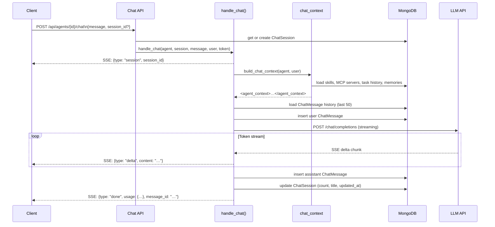

# Agent Chat Feature — Plan

## Overview

This document describes the design and implementation plan for **M7: Agent Chat** — a passive, conversational interface that lets users talk to their agents about their configuration, abilities, and past work without triggering any tool execution or Celery tasks.

Users can ask questions like:

- *"What have you been working on?"*
- *"What tools do you have access to?"*
- *"What do you remember about the last deployment?"*
- *"What skills are you configured with?"*

---

## Architecture

```mermaid
flowchart TD
    Client["Client\n(HTTP)"] -->|POST /api/agents/{id}/chat| ChatRoute["Chat API\napp/api/routes/chat.py"]
    ChatRoute -->|resolve/create| SessionDB[("MongoDB\nchat_sessions")]
    ChatRoute -->|resolve user| Auth["GitHub Auth\napp/api/deps.py"]
    ChatRoute -->|stream events| SSE["SSE StreamingResponse\ntext/event-stream"]
    ChatRoute -->|calls| Handler["handle_chat()\napp/services/chat_handler.py"]

    Handler -->|load history| MsgDB[("MongoDB\nchat_messages")]
    Handler -->|build context| ContextBuilder["build_chat_context()\napp/services/chat_context.py"]
    Handler -->|resolve key| ProviderDB[("MongoDB\nproviders / tokens")]
    Handler -->|POST streaming| LLM["LLM API\n(httpx, OpenAI-compatible)"]
    Handler -->|persist messages| MsgDB
    Handler -->|update session| SessionDB
    Handler -->|yield events| ChatRoute

    ContextBuilder -->|agent profile| AgentDB[("MongoDB\nagents")]
    ContextBuilder -->|skills| SkillDB[("MongoDB\nskills")]
    ContextBuilder -->|MCP tools| MCPsDB[("MongoDB\nmcp_servers")]
    ContextBuilder -->|task history| TaskDB[("MongoDB\ntask_executions / workflows")]
    ContextBuilder -->|STM/LTM memory| MemoryMgr["MemoryManager\n(Redis + MongoDB)"]

    SSE -->|event: session| Client
    SSE -->|event: delta| Client
    SSE -->|event: done| Client
    SSE -->|event: error| Client

    style Client fill:#dbeafe,stroke:#3b82f6
    style LLM fill:#fef9c3,stroke:#ca8a04
    style SessionDB fill:#f3e8ff,stroke:#9333ea
    style MsgDB fill:#f3e8ff,stroke:#9333ea
    style ProviderDB fill:#f3e8ff,stroke:#9333ea
    style AgentDB fill:#f3e8ff,stroke:#9333ea
    style SkillDB fill:#f3e8ff,stroke:#9333ea
    style MCPsDB fill:#f3e8ff,stroke:#9333ea
    style TaskDB fill:#f3e8ff,stroke:#9333ea
```

---

## Data Flow



---

## Component Breakdown

### `app/models/chat_session.py` — ChatSession

Beanie document persisting a named conversation thread.

| Field | Type | Description |
|-------|------|-------------|
| `agent_id` | `PydanticObjectId` | The agent this session belongs to |
| `github_user` | `str` | Owner — scopes access |
| `title` | `str \| None` | Auto-generated from first message |
| `message_count` | `int` | Running total of messages |
| `created_at` / `updated_at` | `datetime` | Timestamps |

Index: `(agent_id, github_user, updated_at DESC)` for paginated listing.

---

### `app/models/chat_message.py` — ChatMessage

Beanie document for individual messages within a session.

| Field | Type | Description |
|-------|------|-------------|
| `session_id` | `PydanticObjectId` | Parent session |
| `role` | `"user" \| "assistant"` | Message author |
| `content` | `str` | Message text |
| `usage` | `dict \| None` | Token counts (assistant messages only) |
| `created_at` | `datetime` | Timestamp |

Index: `(session_id, created_at ASC)` for chronological history retrieval.

---

### `app/services/chat_context.py` — Agent Self-Awareness Context

Builds an XML `<agent_context>` block injected into the chat system prompt.

```xml
<agent_context>
  <agent_profile>
    <name>Deploy Assistant</name>
    <model>gpt-4o</model>
    <description>Handles deployment workflows</description>
  </agent_profile>
  <skills>
    <skill><name>Kubernetes</name><description>…</description></skill>
  </skills>
  <available_tools>
    <tool>kubectl_apply</tool>
    <tool>git_push</tool>
  </available_tools>
  <task_history>
    <task>
      <prompt>Deploy v2.3.0 to staging</prompt>
      <status>completed</status>
      <created_at>2026-04-17T10:00:00Z</created_at>
    </task>
  </task_history>
  <!-- STM/LTM memories injected here -->
</agent_context>
```

---

### `app/services/chat_handler.py` — In-process LLM Handler

Async generator that yields `ChatEvent` dicts.

**Key design decisions:**

- **No Celery dispatch** — runs in the FastAPI process for low latency
- **No tool execution** — `stream=True`, no `tools` array in the request body
- **No guardrails** — v1 simplicity; may be added in a future milestone
- **Conversation windowing** — loads last 50 messages; oldest are dropped
- **BYOK support** — resolves the agent's attached provider (or falls back to the GitHub Models inference endpoint with the user's GitHub token)

---

### `app/api/routes/chat.py` — HTTP Endpoints

| Method | Path | Description |
|--------|------|-------------|
| `POST` | `/api/agents/{id}/chat` | Send message → SSE stream |
| `GET` | `/api/agents/{id}/chat/sessions` | List sessions (newest first) |
| `GET` | `/api/agents/{id}/chat/sessions/{sid}` | Session + message history |
| `DELETE` | `/api/agents/{id}/chat/sessions/{sid}` | Delete session + messages |

**Auth:** Same `X-GitHub-Token` / `Authorization: Bearer` mechanism as all other endpoints. Sessions are scoped to `github_user`.

---

## SSE Event Protocol

```
id: 1
data: {"type": "session", "session_id": "abc123"}

id: 2
data: {"type": "delta", "content": "Based on"}

id: 3
data: {"type": "delta", "content": " my recent activity…"}

…

id: N
data: {"type": "done", "usage": {"prompt_tokens": 500, "completion_tokens": 120}, "message_id": "xyz789"}
```

On error:

```
id: N
data: {"type": "error", "message": "Provider unavailable: connection refused"}
```

---

## Observability

Two new Prometheus metrics in `app/observability.py`:

| Metric | Type | Labels |
|--------|------|--------|
| `copilot_hub_chat_messages_total` | Counter | `role` (user/assistant) |
| `copilot_hub_chat_response_duration_seconds` | Histogram | `model` |

The existing `copilot_hub_sse_connections_active` gauge is reused for chat SSE connections.

---

## Acceptance Criteria

- [x] `ChatSession` and `ChatMessage` models with DB indexes
- [x] Pydantic schemas for request/response
- [x] Models registered with Beanie in `app/db.py`
- [x] `POST /api/agents/{id}/chat` — SSE streaming response
- [x] Session create-or-reuse logic
- [x] `GET /api/agents/{id}/chat/sessions` — paginated list
- [x] `GET /api/agents/{id}/chat/sessions/{sid}` — full message history
- [x] `DELETE /api/agents/{id}/chat/sessions/{sid}` — cascade delete
- [x] Auth enforcement (user-scoped sessions)
- [x] `handle_chat()` in-process async generator
- [x] BYOK provider support + GitHub Models default path
- [x] Conversation windowing (50 messages)
- [x] `build_chat_context()` — agent profile, skills, tools, task history, memories
- [x] Chat observability metrics
- [x] Unit tests (`tests/test_chat.py`)
- [x] API reference (`docs/api/chat.md`)
- [x] User guide (`docs/guide/agent-chat.md`)
