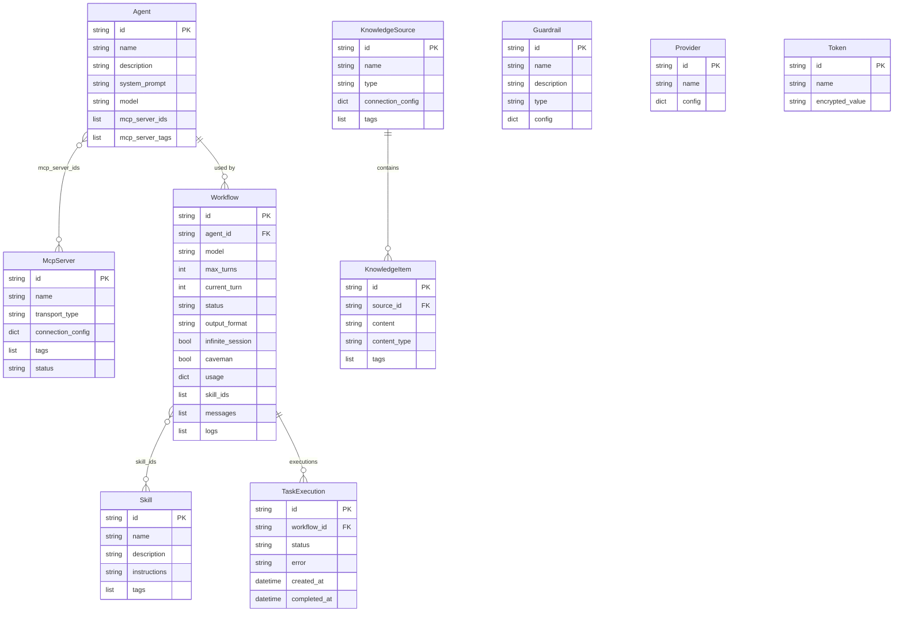

# Data Model

All persistent state is stored in MongoDB using Beanie ODM (async MongoDB object-document mapper built on Motor).

---

## Entity Relationship Diagram

---

## Core Entities

### Agent

The reusable definition of an AI agent — personality, model, and tool access.

| Field | Type | Description |
|---|---|---|
| `name` | string | Unique agent name |
| `description` | string | Optional description |
| `system_prompt` | string | Defines agent behaviour |
| `model` | string | Copilot model (e.g. `gpt-4.1`) |
| `mcp_server_ids` | string[] | Explicit MCP server references |
| `mcp_server_tags` | string[] | Tag-based MCP resolution |

### Workflow

An execution context that ties an agent to a conversation session.

| Field | Type | Description |
|---|---|---|
| `agent_id` | string | Reference to the agent |
| `model` | string | Optional model override |
| `max_turns` | int | Tool-call round limit |
| `current_turn` | int | Current turn counter |
| `status` | enum | `active` / `running` / `completed` / `failed` / `max_turns` |
| `output_format` | string | `json` or `markdown` |
| `infinite_session` | bool | Enable context compaction |
| `caveman` | bool | Enable terse output + compressed injected context |
| `usage` | object | `{premium_req, in_tok, out_tok, cache_read, cache_write, cost}` |
| `skill_ids` | string[] | Installed skills |
| `messages` | array | `{role, content, tool_calls}` |
| `logs` | array | `{timestamp, event, detail}` |

### McpServer

A registered MCP tool server.

| Field | Type | Description |
|---|---|---|
| `name` | string | Server name |
| `transport_type` | enum | `stdio` or `sse` |
| `connection_config` | object | Transport-specific config |
| `tags` | string[] | Free-form labels |
| `status` | enum | `registered` / `connected` / `error` |

### Skill

A reusable instruction module.

| Field | Type | Description |
|---|---|---|
| `name` | string | Skill name |
| `description` | string | Human-readable description |
| `instructions` | string | Injected into system prompt at runtime |
| `tags` | string[] | Free-form labels |
