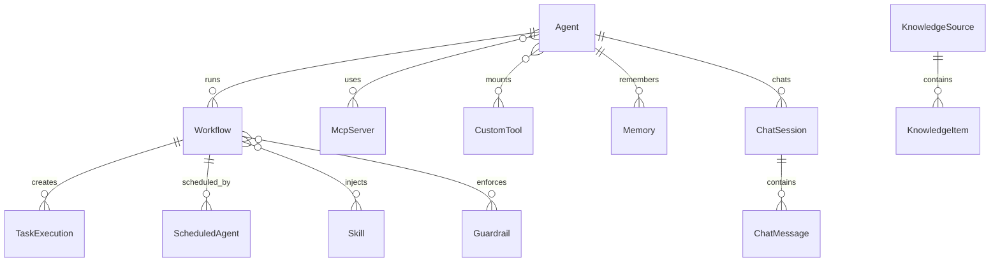

# Data Model

Persistent state is stored in MongoDB with Beanie by default, or in PostgreSQL tables with typed columns and JSONB fields when `DB_BACKEND=postgres`.

## Core Entities

| Entity | Important fields |
|---|---|
| Agent | `name`, `description`, `system_prompt`, `model`, `mcp_server_ids`, `mcp_server_tags`, `tool_definitions`, `knowledge_source_ids`, `knowledge_tags`, `builtin_tools`, `custom_tool_ids`, `provider_id` |
| MCP Server | `name`, `transport_type`, `connection_config`, `allowed_tools`, `tags`, `status`, `last_error` |
| Skill | `name`, `description`, `instructions`, `tags` |
| Workflow | `title`, `agent_id`, `github_user`, `model`, `max_turns`, `current_turn`, `skill_ids`, `skill_tags`, `status`, `output_format`, `infinite_session`, `caveman`, `bypass_memory`, `auto_memory`, `tsv_tool_results`, `reasoning_effort`, `guardrail_ids`, `guardrail_tags`, `repo_url`, `repo_branch`, `repo_token_name`, `credential_overrides`, `webhook_url`, `error_webhook_url`, `usage`, `messages`, `logs` |
| TaskExecution | `workflow_id`, `prompt`, `status`, `celery_task_id`, `worker`, `model`, `reasoning_effort`, `tool_calls`, `response`, `progress`, `logs`, `messages`, `usage`, timestamps |
| ScheduledAgent | `name`, `workflow_id`, `prompt`, `interval_value`, `interval_unit`, `start_at`, `end_at`, `enabled`, `last_run_at`, `next_run_at` |
| KnowledgeSource | `name`, `description`, `source_type`, `connection_config`, `tags`, `status`, `last_error` |
| KnowledgeItem | `source_id`, `name`, `content_type`, `text_content`, `file_id`, `file_name`, `file_size`, `mime_type`, `tags`, `metadata` |
| Guardrail | `name`, `description`, `guardrail_type`, `tags`, `enabled`, `prompt_config`, `request_config`, `output_config` |
| Token | `name`, `encrypted_value`, `description`, `created_by` |
| Provider | Provider type, API key token name, auth config, base URL/model settings |
| Memory | `agent_id`, `scope`, `key`, `value`, `embedding`, `metadata`, `ttl` |
| CustomTool | `name`, `description`, `source_code`, `parameters_schema`, `env_config`, `tags`, `is_enabled`, `is_plugin` |
| ChatSession / ChatMessage | Agent-scoped chat sessions and persisted messages for API clients |

## Relationships

PostgreSQL schema changes are managed by Alembic; MongoDB remains schema-flexible and uses defaults on read/write.
