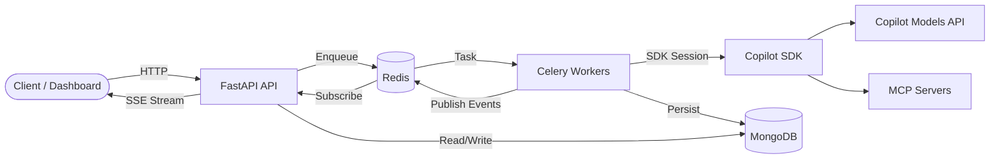

# Architecture

TBD Agents is a distributed system designed to run custom AI agents at scale.

-   :material-sitemap:{ .lg .middle } **System Overview**

    ---

    Components, request flow, and how the pieces connect.

    [:octicons-arrow-right-24: System Overview](system-overview.md)

-   :material-database:{ .lg .middle } **Data Model**

    ---

    Entity relationships and document schemas.

    [:octicons-arrow-right-24: Data Model](data-model.md)

-   :material-arrow-expand-all:{ .lg .middle } **Scaling**

    ---

    Horizontal scaling strategies for workers, API, and infrastructure.

    [:octicons-arrow-right-24: Scaling](scaling.md)

---

## System at a Glance

