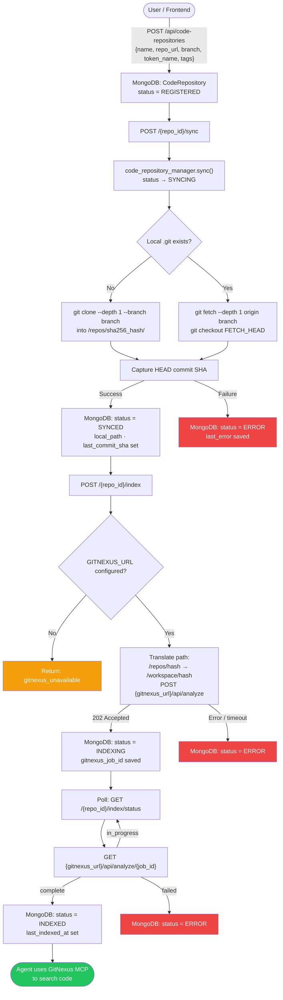
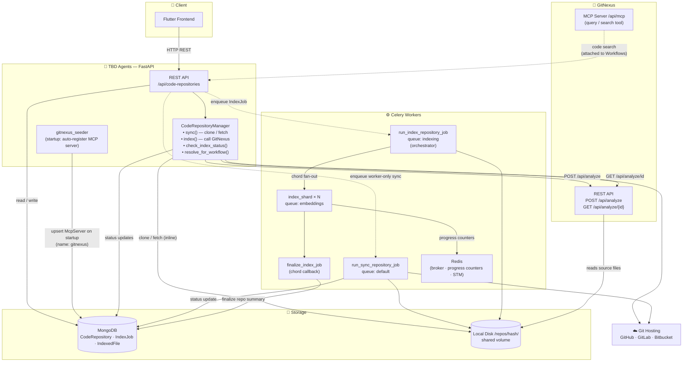

# Code Repository Onboarding

This page documents how a code repository is registered, synced, and indexed — and how **GitNexus** provides code-intelligence on top.

---

## Onboarding Flow

---

## Architecture

---

## GitNexus Role Summary

| Stage | What happens |
|---|---|
| **App startup** | `gitnexus_seeder` upserts a `McpServer` record (name `gitnexus`, transport HTTP) pointing at `{GITNEXUS_URL}/api/mcp`. |
| **Index trigger** | `POST /{repo_id}/index` → `CodeRepositoryManager.index()` posts `{"path": "/workspace/<hash>"}` to `{GITNEXUS_URL}/api/analyze`. The repo hash directory is shared between TBD Agents and GitNexus via a Docker volume. |
| **Progress polling** | `GET /{repo_id}/index/status` proxies `GET {GITNEXUS_URL}/api/analyze/{job_id}` and drives the repo status to `INDEXED` (or `ERROR`). |
| **Code search** | Agents attach the `gitnexus` MCP server to their Workflows. The MCP `query` tool is the primary code-search interface; the internal Qdrant embedding pipeline is now a compatibility stub. |
