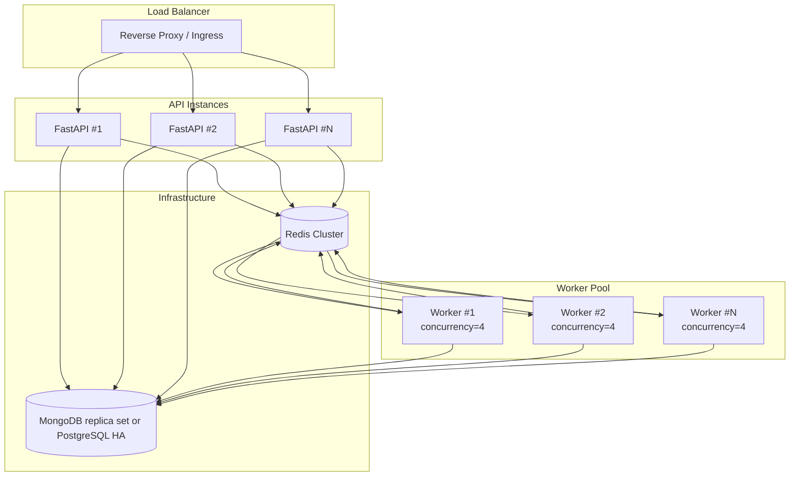
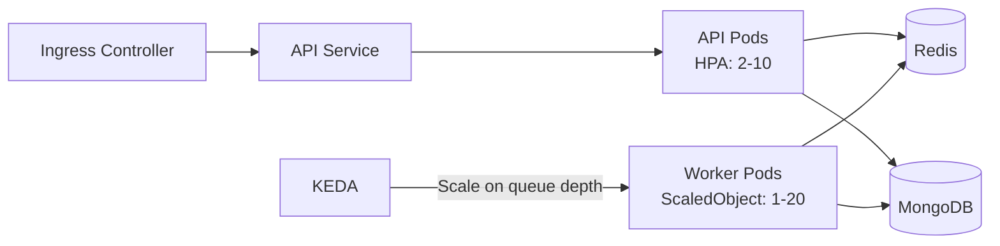

# Scaling

TBD Agents is designed for horizontal scaling from day one. All components are stateless (except the databases), so you can add capacity by running more instances.

---

## Scaling Strategy



---

## Horizontal Worker Scaling

Workers are stateless — they load persistent state from MongoDB or PostgreSQL and communicate via Redis. Add more containers to handle more concurrent agent runs.

```bash
# Docker Compose — run 5 worker containers
docker compose up --build --scale worker=5

# Each worker runs --concurrency=4
# Total = 20 concurrent agent executions
```

---

## Horizontal API Scaling

The FastAPI `app` service is also stateless. Run multiple instances behind a load balancer:

```bash
docker compose up --build --scale app=3
```

SSE connections are per-client, and each API instance independently subscribes to Redis pub/sub for the relevant workflow channel.

---

## Infrastructure Scaling

| Component | Strategy |
|---|---|
| **Redis** | Redis Sentinel or Redis Cluster for high availability |
| **Document store** | MongoDB replica sets/Atlas or PostgreSQL HA/managed Postgres |
| **Vector store** | Qdrant cluster/cloud or PostgreSQL pgvector on the PostgreSQL backend |
| **Workers** | Increase `--concurrency` per container or add containers |
| **API** | Multiple instances behind a reverse proxy |

---

## Kubernetes / Helm

TBD Agents includes Helm charts for Kubernetes deployment with:

- **API HPA** — Horizontal Pod Autoscaler for the FastAPI service
- **KEDA ScaledObject** — Autoscale workers based on Redis queue length
- **PVC** — Persistent volume claims for data
- **Ingress** — Configurable ingress for external access



---

## Capacity Planning

| Metric | Guidance |
|---|---|
| **Concurrent agents** | 1 agent ≈ 1 Celery task slot. `workers × concurrency` = max concurrent |
| **Memory per worker** | ~256MB base + SDK overhead per concurrent task |
| **Redis memory** | Minimal for pub/sub; grows with in-flight task count |
| **MongoDB storage** | ~10KB per workflow message; grows with conversation history |
| **SSE connections** | 1 per active client; lightweight on API side |
