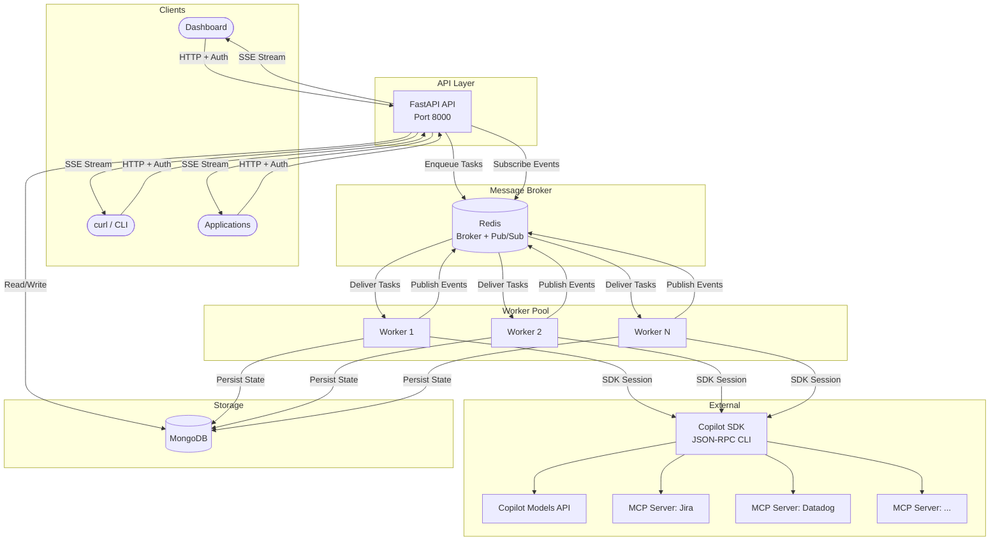
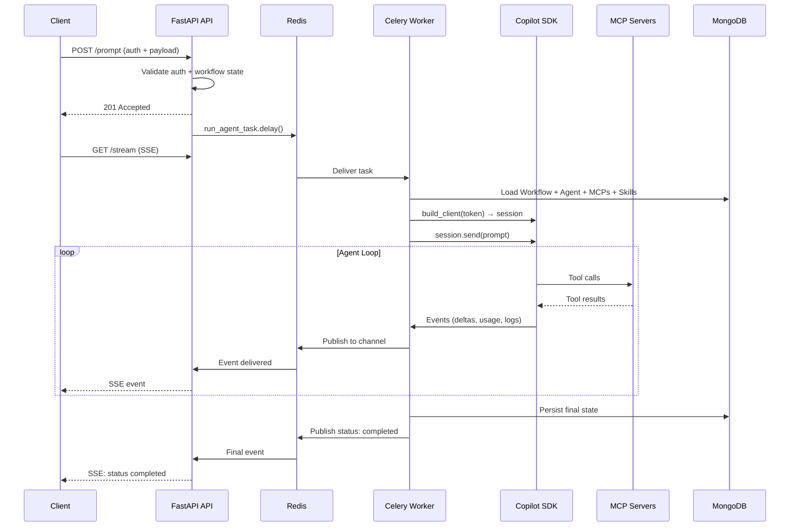

# System Overview

TBD Agents separates concerns across four main components connected by Redis and MongoDB.

---

## High-Level Architecture



---

## Components

### FastAPI API

The API layer handles authentication, CRUD for agents/skills/MCP servers/workflows, and SSE streaming. It does **not** run agent logic — that's dispatched to workers.

- **Endpoints** serve REST requests and validate GitHub PAT tokens
- **SSE endpoint** (`GET /api/workflows/{id}/stream`) subscribes to a Redis pub/sub channel and streams events to the client
- **Prompt dispatch** — `POST /api/workflows/{id}/prompt` enqueues a Celery task and returns `201` immediately

### Celery Workers

Workers execute the actual agent loop. Each worker:

1. Receives a task from the Redis queue containing `(workflow_id, prompt, github_token)`
2. Initialises its own MongoDB connection via Beanie/Motor
3. Loads the Workflow, Agent, MCP servers, and Skills from the database
4. Creates a Copilot SDK session with the agent's configuration
5. Runs the SDK agentic loop — the SDK handles planning, tool calls, and response generation
6. Publishes real-time events (logs, message deltas, usage stats, status changes) to Redis pub/sub
7. Persists final state (messages, logs, usage, status) to MongoDB

**Key Celery settings:**

| Setting | Value | Why |
|---|---|---|
| `worker_prefetch_multiplier` | `1` | Agent tasks are long-running; don't hoard |
| `task_acks_late` | `True` | Re-queue tasks if a worker crashes |
| `task_reject_on_worker_lost` | `True` | Return tasks to the queue on shutdown |

### Redis

Redis serves two roles:

1. **Celery broker/backend** — task queue for dispatching agent work and storing task results
2. **Event bus (pub/sub)** — workers publish events to `workflow:events:{id}` channels; the FastAPI SSE endpoint subscribes and relays events to clients

This decoupling enables multi-process and multi-node scaling — any worker can publish events that any API instance can stream.

### MongoDB

Stores all persistent state: agents, MCP servers, skills, workflows (including messages, logs, and usage stats). Each worker initialises its own Motor/Beanie connection on startup.

---

## Request Flow



---

## Event Bus Protocol

Events published to Redis channel `workflow:events:{workflow_id}`:

```json
{
  "type": "log | message | message_delta | usage | status",
  "data": { "..." },
  "timestamp": "2026-04-10T12:00:00+00:00"
}
```

| Event Type | Payload | Description |
|---|---|---|
| `log` | `{event, detail}` | Agent lifecycle events |
| `message` | `{role, content}` | Complete assistant/tool message |
| `message_delta` | `{delta}` | Streaming token fragment |
| `usage` | `{total_in, total_out, cost...}` | Cumulative usage stats |
| `status` | `{status, current_turn}` | Workflow state changes |

---

## Hooks & Error Recovery

The agent engine uses the Copilot SDK's hooks system for fine-grained control:

| Hook | Behaviour |
|---|---|
| `on_pre_tool_use` | Logs tool invocation; denies if max turns exceeded |
| `on_post_tool_use` | Logs result; injects goal reminder past 50% turns |
| `on_error_occurred` | Retries recoverable errors up to 2×, then aborts |
| `on_session_end` | Logs session end reason |

The **permission handler** enforces max turns by counting tool calls and returning `denied-by-rules` when the limit is exceeded.
