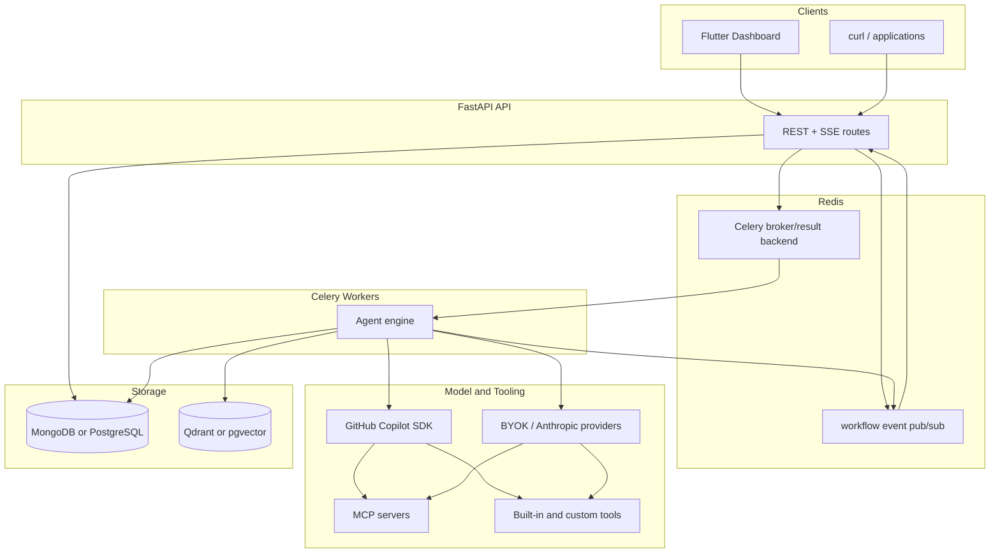

# System Overview

TBD Agents separates HTTP control, asynchronous execution, model/tool integrations, and storage.

## Components

- **FastAPI** handles authentication, CRUD, dashboard static assets, task dispatch, and SSE streaming.
- **Redis** is both Celery broker/backend and event bus for live task events.
- **Celery workers** run the agent loop, load workflow/agent/tool context, call model/provider SDKs, and persist task state.
- **Document store** is MongoDB by default or PostgreSQL when `DB_BACKEND=postgres`.
- **Vector store** is Qdrant by default or pgvector when `VECTOR_STORE_BACKEND=pgvector`.
- **Flutter dashboard** is served at `/dashboard`; the legacy UI is `/dashboard-legacy`.

## Event Types

Workers publish `log`, `message`, `message_delta`, `usage`, and `status` events to `workflow:events:{workflow_id}`. The API relays them to clients over SSE.
