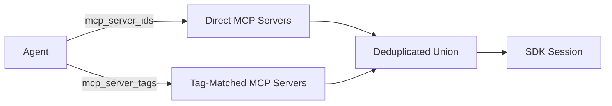

# Agents

Agents are the core building block of TBD Agents. Each agent encapsulates a persona, a model, and a set of tools.

---

## What is an Agent?

An agent combines three things:

- **System prompt** — defines the agent's personality, domain expertise, and behavioural constraints
- **Model** — which Copilot-supported model to use (e.g. `gpt-4.1`, `o3-mini`, `claude-sonnet-4.5`)
- **MCP servers** — which tool servers the agent has access to (by ID or tags)

Create as many agents as you need — a code reviewer, an incident responder, a documentation writer — each with their own configuration. Agents are reusable across workflows.

---

## Creating an Agent

```bash
curl -X POST http://localhost:8000/api/agents \
  -H "Authorization: Bearer $GITHUB_TOKEN" \
  -H "Content-Type: application/json" \
  -d '{
    "name": "incident-responder",
    "system_prompt": "You are an SRE investigating production incidents. Use Datadog to gather metrics and logs, then create a Jira ticket with your findings.",
    "model": "gpt-4.1",
    "mcp_server_ids": ["<DATADOG_MCP_ID>", "<JIRA_MCP_ID>"],
    "mcp_server_tags": ["observability", "ticketing"]
  }'
```

---

## Agent Fields

| Field | Type | Description |
|---|---|---|
| `name` | string | Unique name for the agent |
| `description` | string | Optional human-readable description |
| `system_prompt` | string | Instructions that define agent behaviour |
| `model` | string | Copilot model identifier |
| `mcp_server_ids` | string[] | Explicit list of MCP server IDs |
| `mcp_server_tags` | string[] | Tag-based MCP server resolution |

---

## MCP Server Resolution

Agents select which MCP servers to use in two ways:

1. **By ID** — explicit `mcp_server_ids` list for known servers
2. **By tag** — `mcp_server_tags` list; any MCP server matching at least one tag is included

Both are unioned at runtime with deduplication, so an MCP server that matches both by ID and by tag is only loaded once.



---

## Example Agents

=== "Code Reviewer"

    ```json
    {
      "name": "code-reviewer",
      "system_prompt": "You are an expert code reviewer. Analyze code for bugs, security issues, and style problems.",
      "model": "gpt-4.1"
    }
    ```

=== "Incident Responder"

    ```json
    {
      "name": "incident-responder",
      "system_prompt": "You are an SRE investigating production incidents. Use Datadog to gather metrics and Jira to create tickets.",
      "model": "gpt-4.1",
      "mcp_server_tags": ["observability", "ticketing"]
    }
    ```

=== "Documentation Writer"

    ```json
    {
      "name": "doc-writer",
      "system_prompt": "You write clear technical documentation. Use Notion to publish and Slack to notify the team.",
      "model": "gpt-4.1",
      "mcp_server_tags": ["documentation", "messaging"]
    }
    ```

---

## Using Claude with a Provider

To use Anthropic Claude models natively (via the Claude SDK rather than generic HTTP), create a **Provider** of type `anthropic` and attach it to your agent.

### Step 1: Store your API key

```bash
curl -X POST http://localhost:8000/api/tokens \
  -H "Authorization: Bearer $GITHUB_TOKEN" \
  -H "Content-Type: application/json" \
  -d '{
    "name": "anthropic-key",
    "value": "sk-ant-api03-...",
    "description": "Anthropic API key for Claude"
  }'
```

### Step 2: Create the provider

```bash
curl -X POST http://localhost:8000/api/providers \
  -H "Authorization: Bearer $GITHUB_TOKEN" \
  -H "Content-Type: application/json" \
  -d '{
    "name": "claude-provider",
    "provider_type": "anthropic",
    "api_key_token_name": "anthropic-key",
    "description": "Native Claude SDK provider"
  }'
```

!!! note
    No `base_url` is needed for Anthropic — the SDK uses the official API endpoint automatically. You only need `base_url` for custom or Azure OpenAI providers.

### Step 3: Attach the provider to an agent

```bash
curl -X POST http://localhost:8000/api/agents \
  -H "Authorization: Bearer $GITHUB_TOKEN" \
  -H "Content-Type: application/json" \
  -d '{
    "name": "claude-agent",
    "system_prompt": "You are a helpful assistant powered by Claude.",
    "model": "claude-sonnet-4-20250514",
    "provider_id": "<PROVIDER_ID>"
  }'
```

When a workflow runs with this agent, TBD Agents will:

1. Resolve the API key from the encrypted token store
2. Build a native `AsyncAnthropic` client
3. Map any MCP tools to Claude's `input_schema` format
4. Stream responses with real-time SSE events
5. Handle Claude's `tool_use` content blocks for agentic tool loops

### Supported Claude models

Any model supported by the Anthropic API can be used, for example:

- `claude-sonnet-4-20250514`
- `claude-opus-4-20250514`
- `claude-haiku-35-20241022`
