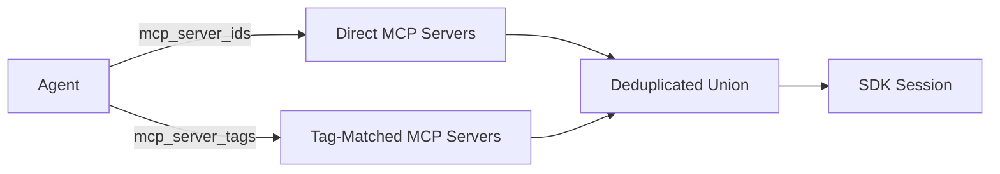

# Agents

Agents are the core building block of TBD Agents. Each agent encapsulates a persona, a model, and a set of tools.

---

## What is an Agent?

An agent combines three things:

- **System prompt** — defines the agent's personality, domain expertise, and behavioural constraints
- **Model** — which Copilot-supported model to use (e.g. `gpt-4.1`, `o3-mini`, `claude-sonnet-4.5`)
- **Tool and context access** — MCP servers, custom tools, built-in tools, providers, and knowledge sources selected by ID or tags

Create as many agents as you need — a code reviewer, an incident responder, a documentation writer — each with their own configuration. Agents are reusable across workflows.

---

## Creating an Agent

```bash
curl -X POST http://localhost:8000/api/agents \
  -H "Authorization: Bearer $GITHUB_TOKEN" \
  -H "Content-Type: application/json" \
  -d '{
    "name": "incident-responder",
    "system_prompt": "You are an SRE investigating production incidents. Use Datadog to gather metrics and logs, then create a Jira ticket with your findings.",
    "model": "gpt-4.1",
    "mcp_server_ids": ["<DATADOG_MCP_ID>", "<JIRA_MCP_ID>"],
    "mcp_server_tags": ["observability", "ticketing"],
    "knowledge_source_ids": ["<RUNBOOK_SOURCE_ID>"],
    "knowledge_tags": ["production"],
    "builtin_tools": ["bash", "read", "grep", "web_fetch"]
  }'
```

---

## Agent Fields

| Field | Type | Description |
|---|---|---|
| `name` | string | Unique name for the agent |
| `description` | string | Optional human-readable description |
| `system_prompt` | string | Instructions that define agent behaviour |
| `model` | string | Copilot model identifier |
| `mcp_server_ids` | string[] | Explicit list of MCP server IDs |
| `mcp_server_tags` | string[] | Tag-based MCP server resolution |
| `custom_tool_ids` | string[] | IDs of Custom Python Tools to mount on this agent |
| `builtin_tools` | string[] | Built-in tool names to enable (e.g. `bash`, `read`) |
| `provider_id` | string | Optional BYOK provider ID |
| `tool_definitions` | object[] | Additional provider-compatible tool definitions |
| `knowledge_source_ids` | string[] | Explicit knowledge source IDs for retrieval |
| `knowledge_tags` | string[] | Tag-based knowledge source/item matching |

The Flutter Agent dialog exposes name, description, system prompt, model, provider, MCP servers, custom tools, knowledge sources, built-in tools, MCP tags, and knowledge tags. Built-in tools include `bash`, `read`, `write`, `edit`, `glob`, `grep`, `web_fetch`, and `web_search`.

---

## MCP Server Resolution

Agents select which MCP servers to use in two ways:

1. **By ID** — explicit `mcp_server_ids` list for known servers
2. **By tag** — `mcp_server_tags` list; any MCP server matching at least one tag is included

Both are unioned at runtime with deduplication, so an MCP server that matches both by ID and by tag is only loaded once.



---

## Example Agents

=== "Code Reviewer"

    ```json
    {
      "name": "code-reviewer",
      "system_prompt": "You are an expert code reviewer. Analyze code for bugs, security issues, and style problems.",
      "model": "gpt-4.1"
    }
    ```

=== "Incident Responder"

    ```json
    {
      "name": "incident-responder",
      "system_prompt": "You are an SRE investigating production incidents. Use Datadog to gather metrics and Jira to create tickets.",
      "model": "gpt-4.1",
      "mcp_server_tags": ["observability", "ticketing"]
    }
    ```

=== "Documentation Writer"

    ```json
    {
      "name": "doc-writer",
      "system_prompt": "You write clear technical documentation. Use Notion to publish and Slack to notify the team.",
      "model": "gpt-4.1",
      "mcp_server_tags": ["documentation", "messaging"]
    }
    ```

---

## Custom Tool Lock-in

Custom Tools are user-written Python functions registered on the platform. You lock them to an agent by listing their IDs in `custom_tool_ids`.

```bash
# 1. Create the tool
curl -X POST http://localhost:8000/api/custom-tools \
  -H "Authorization: Bearer $GITHUB_TOKEN" \
  -H "Content-Type: application/json" \
  -d '{
    "name": "summarise_csv",
    "description": "Compute basic statistics for a numeric CSV column",
    "source_code": "def summarise_csv(csv_text: str, column: str) -> dict:\n    return {\"column\": column}",
    "tags": ["data"]
  }'

# 2. Mount the tool on an agent
curl -X PUT http://localhost:8000/api/agents/<AGENT_ID> \
  -H "Authorization: Bearer $GITHUB_TOKEN" \
  -H "Content-Type: application/json" \
  -d '{"custom_tool_ids": ["<TOOL_ID>"] }'
```

Custom tools are **additive** — they combine with MCP servers and built-in tools. Disabled tools (``is_enabled: false``) are silently skipped at runtime.

!!! tip
    See the [Custom Tools guide](custom-tools.md) for the full authoring reference, execution model, and examples.

---

## Using Claude with the Claude Agent SDK

To use Anthropic Claude models via the **Claude Agent SDK** — a full agentic runtime analogous to the Copilot SDK — create a **Provider** of type `anthropic` and attach it to your agent.

The Claude Agent SDK creates environments, agents, and sessions on Anthropic's infrastructure. It handles the complete agentic loop server-side: planning, tool invocation, context compaction, and response generation.

### Step 1: Store your API key

```bash
curl -X POST http://localhost:8000/api/tokens \
  -H "Authorization: Bearer $GITHUB_TOKEN" \
  -H "Content-Type: application/json" \
  -d '{
    "name": "anthropic-key",
    "value": "sk-ant-api03-...",
    "description": "Anthropic API key for Claude Agent SDK"
  }'
```

### Step 2: Create the provider

```bash
curl -X POST http://localhost:8000/api/providers \
  -H "Authorization: Bearer $GITHUB_TOKEN" \
  -H "Content-Type: application/json" \
  -d '{
    "name": "claude-provider",
    "provider_type": "anthropic",
    "api_key_token_name": "anthropic-key",
    "description": "Claude Agent SDK provider"
  }'
```

!!! note
    No `base_url` is needed for Anthropic — the SDK uses the official API endpoint automatically. You only need `base_url` for custom or Azure OpenAI providers.

### Step 3: Attach the provider to an agent

```bash
curl -X POST http://localhost:8000/api/agents \
  -H "Authorization: Bearer $GITHUB_TOKEN" \
  -H "Content-Type: application/json" \
  -d '{
    "name": "claude-agent",
    "system_prompt": "You are a helpful assistant powered by Claude.",
    "model": "claude-sonnet-4-6",
    "provider_id": "<PROVIDER_ID>"
  }'
```

When a workflow runs with this agent, TBD Agents will:

1. Resolve the API key from the encrypted token store
2. Create a Claude Agent SDK environment, agent, and session
3. Pass URL-based MCP servers natively to the Claude Agent SDK
4. Register stdio-based MCP tools as custom tools (handled locally)
5. Stream session events with real-time SSE publishing
6. Handle `agent.custom_tool_use` events by calling local MCP servers
7. Track usage from `span.model_request_end` events
8. Clean up Agent SDK resources (session, agent, environment) on completion

### MCP Server Handling

The Claude Agent SDK natively supports **URL-based** MCP servers (SSE and HTTP transports). These are passed directly to the agent and connected on Anthropic's infrastructure.

For **stdio-based** MCP servers (local processes), TBD Agents:

- Connects to them locally
- Discovers their tools
- Registers each tool as a `custom` tool on the Claude agent
- Handles `agent.custom_tool_use` events by routing to the local MCP session

### Supported Claude models

Any model supported by the Anthropic API can be used, for example:

- `claude-sonnet-4-6`
- `claude-opus-4-6`
- `claude-haiku-35-20241022`
