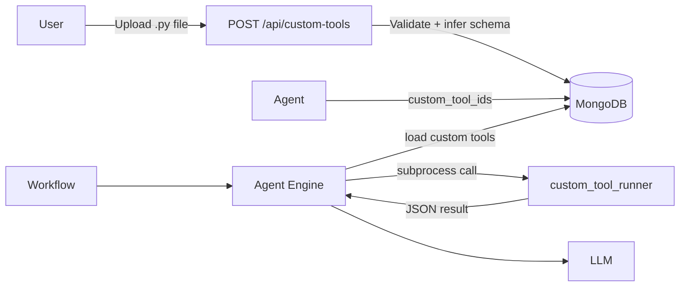

# Custom Tools

Custom Tools let you write Python functions and expose them as agent tools — without spinning up an MCP server. Upload a `.py` file, lock it to an agent, and the function is available in every workflow that uses that agent.

---

## How it works



1. You upload a Python source file (or paste source code directly).
2. TBD Agents validates the function, infers a JSON Schema from its type hints, and stores everything in MongoDB.
3. You lock the tool to an agent by adding its ID to `custom_tool_ids`.
4. At runtime, the engine loads the enabled tools, adds them to the model's tool definitions, and routes `tool_use` events to the subprocess runner.

---

## Writing a Custom Tool

A custom tool is **a single Python function** in a `.py` file. The filename stem becomes the tool name.

```python title="weather.py"
import httpx

def weather(city: str, units: str = "metric") -> dict:
    """Return current weather for a city."""
    resp = httpx.get(
        "https://api.open-meteo.com/v1/forecast",
        params={"latitude": 0, "longitude": 0, "current_weather": True},
        timeout=10,
    )
    resp.raise_for_status()
    return resp.json()
```

### Rules

| Rule | Detail |
|------|--------|
| **One function per file** | The function name must match the filename stem (e.g. `weather.py` → `def weather`) |
| **Type annotations** | Parameters with Python type hints (`str`, `int`, `float`, `bool`, `list`, `dict`) have their JSON Schema inferred automatically. Unannotated parameters default to `string`. |
| **Return value** | Return a `dict` (rendered as-is) or any JSON-serialisable value (wrapped as `{"result": value}`). |
| **Async support** | Both `def` and `async def` are supported. |
| **Imports** | Any package installed in the same virtual environment can be imported. |
| **Timeout** | Execution is capped at **30 seconds**. |

---

## Registering a Tool

=== "Upload a .py file"

    ```bash
    curl -X POST http://localhost:8000/api/custom-tools/upload \
      -H "Authorization: Bearer $GITHUB_TOKEN" \
      -F "file=@weather.py"
    ```

    The tool name is derived from the filename (`weather`).

=== "Paste source code"

    ```bash
    curl -X POST http://localhost:8000/api/custom-tools \
      -H "Authorization: Bearer $GITHUB_TOKEN" \
      -H "Content-Type: application/json" \
      -d '{
        "name": "weather",
        "description": "Fetch current weather for a city",
        "source_code": "def weather(city: str) -> dict:\n    return {\"city\": city, \"temp\": 22}",
        "tags": ["utility", "weather"]
      }'
    ```

Both routes validate the source code and infer the JSON Schema before saving.

**Response:** `201 Created`

```json
{
  "id": "6601a1b2c3d4e5f607890abc",
  "name": "weather",
  "description": "Fetch current weather for a city",
  "parameters_schema": {
    "type": "object",
    "properties": {
      "city": {"type": "string"}
    },
    "required": ["city"]
  },
  "tags": ["utility", "weather"],
  "is_enabled": true,
  "created_at": "2026-04-21T07:10:00Z",
  "updated_at": "2026-04-21T07:10:00Z"
}
```

---

## Validating Source Before Saving

Check whether source code is valid and see the inferred schema without persisting anything:

```bash
curl -X POST http://localhost:8000/api/custom-tools/validate \
  -H "Authorization: Bearer $GITHUB_TOKEN" \
  -H "Content-Type: application/json" \
  -d '{
    "name": "weather",
    "source_code": "def weather(city: str, units: str = \"metric\") -> dict:\n    return {\"city\": city}"
  }'
```

```json
{
  "valid": true,
  "inferred_schema": {
    "type": "object",
    "properties": {
      "city":  {"type": "string"},
      "units": {"type": "string"}
    },
    "required": ["city"]
  },
  "error": null
}
```

---

## Locking a Tool to an Agent

Add the tool ID(s) to `custom_tool_ids` when creating or updating an agent:

```bash
curl -X PUT http://localhost:8000/api/agents/<AGENT_ID> \
  -H "Authorization: Bearer $GITHUB_TOKEN" \
  -H "Content-Type: application/json" \
  -d '{
    "custom_tool_ids": ["6601a1b2c3d4e5f607890abc"]
  }'
```

The tools are **additive** — they are merged with any MCP servers and built-in tools the agent already has.

---

## Ad-hoc Testing

Run a tool against live arguments without a full workflow:

```bash
curl -X POST http://localhost:8000/api/custom-tools/<TOOL_ID>/run \
  -H "Authorization: Bearer $GITHUB_TOKEN" \
  -H "Content-Type: application/json" \
  -d '{
    "arguments": {"city": "London", "units": "metric"}
  }'
```

```json
{
  "tool_name": "weather",
  "result": "{\"city\": \"London\", \"temp\": 18}",
  "success": true,
  "error": null
}
```

!!! warning "Disabled tools"
    Running a disabled tool returns `409 Conflict`. Enable the tool with a `PUT` request first.

---

## Managing Tools

### List all tools

```bash
curl http://localhost:8000/api/custom-tools \
  -H "Authorization: Bearer $GITHUB_TOKEN"
```

### Get a single tool

```bash
curl http://localhost:8000/api/custom-tools/<TOOL_ID> \
  -H "Authorization: Bearer $GITHUB_TOKEN"
```

### Update a tool

```bash
curl -X PUT http://localhost:8000/api/custom-tools/<TOOL_ID> \
  -H "Authorization: Bearer $GITHUB_TOKEN" \
  -H "Content-Type: application/json" \
  -d '{
    "description": "Updated description",
    "is_enabled": false
  }'
```

!!! note "Schema re-inference"
    If you update `source_code` or `name`, the schema is automatically re-inferred from the new function signature unless you explicitly provide `parameters_schema`.

### Delete a tool

```bash
curl -X DELETE http://localhost:8000/api/custom-tools/<TOOL_ID> \
  -H "Authorization: Bearer $GITHUB_TOKEN"
```

**Response:** `204 No Content`

---

## Execution Model

Custom tools run in a **sandboxed subprocess** using the same Python interpreter as the main application:

- **Isolation** — each call spawns a fresh subprocess; state does not persist between calls
- **Timeout** — 30-second wall-clock limit; a `{"error": "timed out"}` is returned on expiry
- **Async** — `async def` functions are executed via `asyncio.run()`
- **Imports** — all packages in the application virtual environment are available
- **Error handling** — uncaught exceptions are captured and returned as `{"error": "<message>"}`

!!! tip "Multi-tenant environments"
    For shared deployments, consider additional OS-level sandboxing (e.g. gVisor or seccomp) since custom tool executions can import arbitrary packages.

---

## Execution Paths

Custom tools are injected into all three execution paths:

| Path | How tools are exposed |
|------|-----------------------|
| **GitHub Copilot SDK** | Not natively supported — use MCP servers instead for Copilot SDK workflows. Custom tools on agents with `provider_id=null` are silently skipped. |
| **BYOK / OpenAI-compatible** | Tools added to the `tools` array in OpenAI function-calling format. `tool_calls` responses are routed to the subprocess runner. |
| **Claude Agent SDK** | Tools registered as `custom` type in the Claude agent definition. `agent.custom_tool_use` events are routed to the subprocess runner. |

---

## Example: Data Processing Tool

```python title="summarise_csv.py"
import csv
import io
import statistics

def summarise_csv(csv_text: str, column: str) -> dict:
    """Compute basic statistics for a numeric column in a CSV string."""
    reader = csv.DictReader(io.StringIO(csv_text))
    values = []
    for row in reader:
        try:
            values.append(float(row[column]))
        except (KeyError, ValueError):
            pass
    if not values:
        return {"error": f"No numeric data found in column '{column}'"}
    return {
        "column": column,
        "count": len(values),
        "mean": round(statistics.mean(values), 4),
        "median": round(statistics.median(values), 4),
        "stdev": round(statistics.stdev(values), 4) if len(values) > 1 else 0,
        "min": min(values),
        "max": max(values),
    }
```

Register and test:

```bash
# Upload
curl -X POST http://localhost:8000/api/custom-tools/upload \
  -H "Authorization: Bearer $GITHUB_TOKEN" \
  -F "file=@summarise_csv.py"

# Test
curl -X POST http://localhost:8000/api/custom-tools/<TOOL_ID>/run \
  -H "Authorization: Bearer $GITHUB_TOKEN" \
  -H "Content-Type: application/json" \
  -d '{
    "arguments": {
      "csv_text": "name,score\nalice,92\nbob,87\ncarol,95",
      "column": "score"
    }
  }'
```

---

## Custom Tools vs MCP Servers

| | Custom Tools | MCP Servers |
|---|---|---|
| **Setup** | Upload a `.py` file | Run a separate server process |
| **Language** | Python only | Any language |
| **Isolation** | Subprocess per call | Separate process |
| **Schema** | Auto-inferred from type hints | Declared by the MCP server |
| **State** | Stateless | Can be stateful |
| **Best for** | Quick utilities, data transforms, API wrappers | Complex integrations, shared tool infrastructure |
