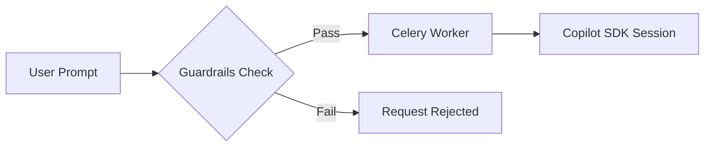

# Guardrails

Guardrails enforce safety policies before agent execution begins. They validate prompts and requests to ensure agents operate within defined boundaries.

---

## How Guardrails Work



Guardrails are evaluated before a prompt reaches the agent. If any guardrail fails, the request is rejected with an explanation.

---

## Creating a Guardrail

```bash
curl -X POST http://localhost:8000/api/guardrails \
  -H "Authorization: Bearer $GITHUB_TOKEN" \
  -H "Content-Type: application/json" \
  -d '{
    "name": "no-pii",
    "description": "Blocks prompts containing personally identifiable information",
    "type": "prompt",
    "config": {
      "patterns": ["\\b\\d{3}-\\d{2}-\\d{4}\\b", "\\b[A-Za-z0-9._%+-]+@[A-Za-z0-9.-]+\\.[A-Z|a-z]{2,}\\b"]
    }
  }'
```

---

## Guardrail Fields

| Field | Type | Description |
|---|---|---|
| `name` | string | Unique name for the guardrail |
| `description` | string | Human-readable description |
| `type` | string | Guardrail type (e.g. `prompt`, `request`) |
| `config` | object | Type-specific configuration |

---

## Managing Guardrails

```bash
# List all guardrails
curl http://localhost:8000/api/guardrails \
  -H "Authorization: Bearer $GITHUB_TOKEN"

# Update a guardrail
curl -X PUT http://localhost:8000/api/guardrails/<ID> \
  -H "Authorization: Bearer $GITHUB_TOKEN" \
  -H "Content-Type: application/json" \
  -d '{"description": "Updated description"}'

# Delete a guardrail
curl -X DELETE http://localhost:8000/api/guardrails/<ID> \
  -H "Authorization: Bearer $GITHUB_TOKEN"
```
