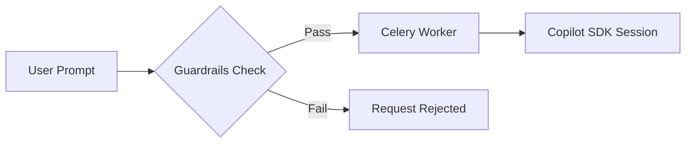

# Guardrails

Guardrails enforce safety policies before agent execution begins. They validate prompts and requests to ensure agents operate within defined boundaries.

---

## How Guardrails Work



Guardrails are evaluated before a prompt reaches the agent. If any guardrail fails, the request is rejected with an explanation.

---

## Creating a Guardrail

```bash
curl -X POST http://localhost:8000/api/guardrails \
  -H "Authorization: Bearer $GITHUB_TOKEN" \
  -H "Content-Type: application/json" \
  -d '{
    "name": "no-pii",
    "description": "Blocks prompts containing personally identifiable information",
    "guardrail_type": "prompt",
    "tags": ["safety"],
    "enabled": true,
    "prompt_config": {
      "forbidden_patterns": ["\\b\\d{3}-\\d{2}-\\d{4}\\b", "\\b[A-Za-z0-9._%+-]+@[A-Za-z0-9.-]+\\.[A-Z|a-z]{2,}\\b"],
      "required_patterns": [],
      "max_length": 4000
    }
  }'
```

---

## Guardrail Fields

| Field | Type | Description |
|---|---|---|
| `name` | string | Unique name for the guardrail |
| `description` | string | Human-readable description |
| `guardrail_type` | string | `prompt`, `request`, or `output` |
| `tags` | string[] | Optional tags for workflow selection |
| `enabled` | boolean | Enable/disable policy evaluation |
| `prompt_config` | object | Prompt policy: `forbidden_patterns`, `required_patterns`, `max_length`, `min_length` |
| `request_config` | object | Request policy with `json_schema` |
| `output_config` | object | Output policy: patterns, `max_length`, `pii_detection`, `must_be_valid_json` |

The Flutter Guardrails page exposes the same three guardrail types. Prompt and output guardrails support forbidden/required patterns and max length; output guardrails also support PII detection and valid JSON enforcement. Request guardrails validate against a JSON Schema.

---

## Managing Guardrails

```bash
# List all guardrails
curl http://localhost:8000/api/guardrails \
  -H "Authorization: Bearer $GITHUB_TOKEN"

# Update a guardrail
curl -X PUT http://localhost:8000/api/guardrails/<ID> \
  -H "Authorization: Bearer $GITHUB_TOKEN" \
  -H "Content-Type: application/json" \
  -d '{"description": "Updated description"}'

# Delete a guardrail
curl -X DELETE http://localhost:8000/api/guardrails/<ID> \
  -H "Authorization: Bearer $GITHUB_TOKEN"
```
