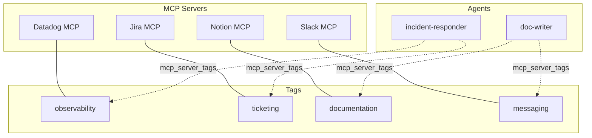

# MCP Tools

TBD Agents supports the [Model Context Protocol (MCP)](https://modelcontextprotocol.io/) — the open standard for connecting AI models to external tools.

---

## Supported Transports

| Transport | How it works |
|---|---|
| **stdio** | Spawns a local process via `npx`; communicates over stdin/stdout |
| **SSE** | Connects to a remote HTTP server via Server-Sent Events |

---

## Registering an MCP Server

=== "stdio (local process)"

    ```bash
    curl -X POST http://localhost:8000/api/mcps \
      -H "Authorization: Bearer $GITHUB_TOKEN" \
      -H "Content-Type: application/json" \
      -d '{
        "name": "jira",
        "transport_type": "stdio",
        "connection_config": {
          "command": "npx",
          "args": ["-y", "@anthropic/mcp-server-atlassian"],
          "env": {
            "ATLASSIAN_API_TOKEN": "...",
            "ATLASSIAN_EMAIL": "...",
            "ATLASSIAN_URL": "..."
          }
        },
        "tags": ["ticketing", "project-management"]
      }'
    ```

=== "SSE (remote server)"

    ```bash
    curl -X POST http://localhost:8000/api/mcps \
      -H "Authorization: Bearer $GITHUB_TOKEN" \
      -H "Content-Type: application/json" \
      -d '{
        "name": "custom-tools",
        "transport_type": "sse",
        "connection_config": {
          "url": "http://my-tool-server:3000/sse",
          "headers": {"Authorization": "Bearer secret"}
        },
        "tags": ["internal"]
      }'
    ```

---

## Testing a Connection

After registering an MCP server, verify it works:

```bash
curl -X POST http://localhost:8000/api/mcps/<MCP_ID>/test \
  -H "Authorization: Bearer $GITHUB_TOKEN"
```

---

## Listing Available Tools

See what tools an MCP server exposes:

```bash
curl http://localhost:8000/api/mcps/<MCP_ID>/tools \
  -H "Authorization: Bearer $GITHUB_TOKEN"
```

---

## MCP Tags

Every MCP server can have **tags** — free-form labels that categorise the server by domain or function.



Tag your Notion MCP as `documentation`, your Slack MCP as `messaging`, your Datadog MCP as `observability`, and agents pick up the right tools by declaring the categories they need.

---

## Popular MCP Servers

| Server | Transport | Tags | Package |
|---|---|---|---|
| Jira / Confluence | stdio | `ticketing` | `@anthropic/mcp-server-atlassian` |
| Datadog | stdio | `observability` | `@anthropic/mcp-server-datadog` |
| Slack | stdio | `messaging` | `@anthropic/mcp-server-slack` |
| Notion | stdio | `documentation` | `@anthropic/mcp-server-notion` |
| GitHub | stdio | `code`, `vcs` | `@anthropic/mcp-server-github` |
