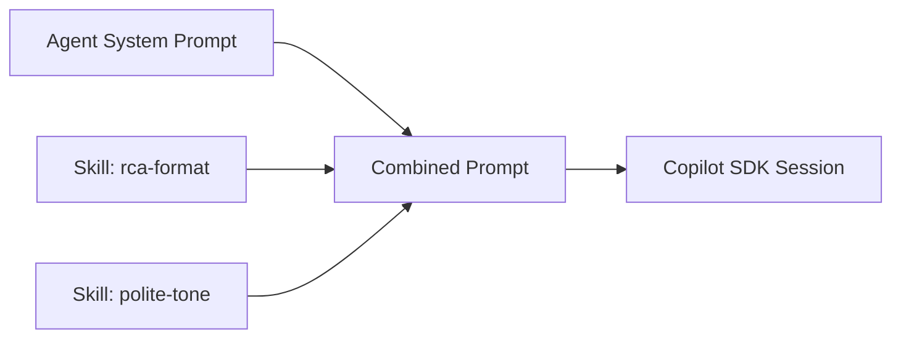

# Skills

Skills are reusable instruction modules that get injected into the system prompt at runtime. They let you shape agent behaviour without editing the agent's core prompt.

---

## How Skills Work

- Each skill has a **name**, **instructions** (free-text), and **tags**
- Skills are installed per-workflow, not per-agent — so the same agent can behave differently in different contexts
- At runtime, skill instructions are appended to the agent's system prompt before the SDK session starts



---

## Creating a Skill

```bash
curl -X POST http://localhost:8000/api/skills \
  -H "Authorization: Bearer $GITHUB_TOKEN" \
  -H "Content-Type: application/json" \
  -d '{
    "name": "rca-format",
    "description": "Structures output as a Root Cause Analysis report",
    "instructions": "Structure your final output as an RCA report with sections: Summary, Timeline, Root Cause, Impact, Remediation, Prevention.",
    "tags": ["incident", "reporting"]
  }'
```

---

## Installing a Skill into a Workflow

```bash
curl -X POST http://localhost:8000/api/workflows/<WF_ID>/skills/<SKILL_ID> \
  -H "Authorization: Bearer $GITHUB_TOKEN"
```

To remove a skill:

```bash
curl -X DELETE http://localhost:8000/api/workflows/<WF_ID>/skills/<SKILL_ID> \
  -H "Authorization: Bearer $GITHUB_TOKEN"
```

---

## Skill Fields

| Field | Type | Description |
|---|---|---|
| `name` | string | Unique name for the skill |
| `description` | string | Human-readable description |
| `instructions` | string | Free-text instructions injected into the system prompt |
| `tags` | string[] | Free-form labels for categorisation |

---

## Example Skills

=== "RCA Format"

    ```json
    {
      "name": "rca-format",
      "instructions": "Structure your final output as an RCA report with sections: Summary, Timeline, Root Cause, Impact, Remediation, Prevention."
    }
    ```

=== "Polite Tone"

    ```json
    {
      "name": "polite-tone",
      "instructions": "Always respond in a polite and professional tone. Avoid jargon unless the user uses it first."
    }
    ```

=== "JSON Only"

    ```json
    {
      "name": "json-output",
      "instructions": "Always respond with valid JSON. Do not include explanation text outside the JSON block."
    }
    ```
