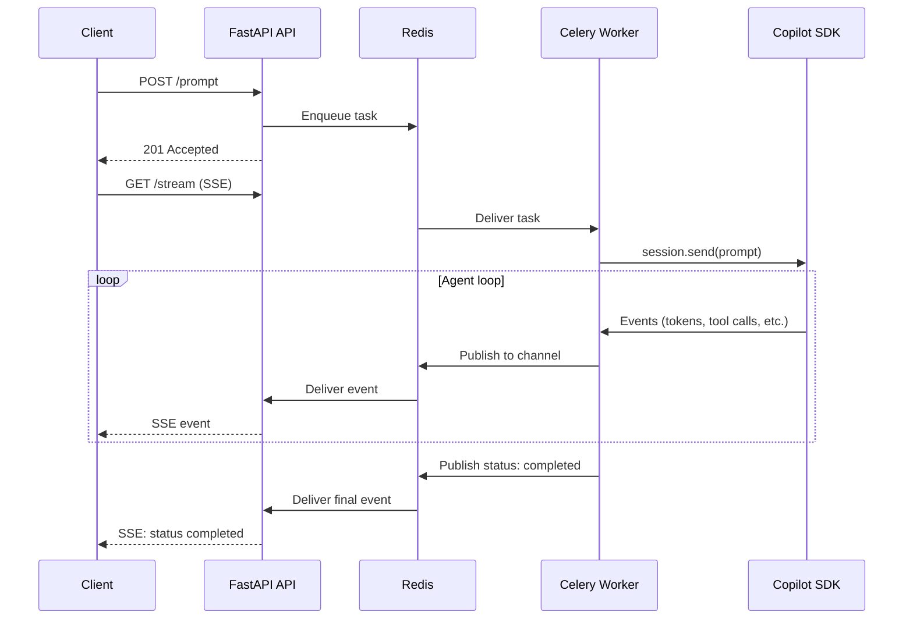

# Real-Time Streaming

When a prompt is sent, the agent runs on a Celery worker and publishes events to Redis. The API's SSE endpoint relays these events to any connected client.

---

## Architecture



---

## Event Types

| Event | Payload | Description |
|---|---|---|
| `log` | `{event, detail}` | Agent lifecycle: tool calls, errors, compaction |
| `message` | `{role, content}` | Complete assistant or tool message |
| `message_delta` | `{delta}` | Streaming token — live character-by-character rendering |
| `usage` | `{total_in, total_out, cost...}` | Cumulative token counts, premium requests, and cost |
| `status` | `{status, current_turn}` | Workflow state changes (running → completed/failed) |

---

## Connecting

=== "curl"

    ```bash
    curl -N http://localhost:8000/api/workflows/<WF_ID>/stream
    ```

=== "JavaScript"

    ```javascript
    const es = new EventSource('/api/workflows/<WF_ID>/stream');
    es.onmessage = (e) => {
      const { type, data } = JSON.parse(e.data);
      // type: log | message | message_delta | usage | status
    };
    ```

=== "Python"

    ```python
    import requests

    with requests.get(
        f"http://localhost:8000/api/workflows/{wf_id}/stream",
        stream=True
    ) as resp:
        for line in resp.iter_lines():
            if line:
                print(line.decode())
    ```

---

## Event Bus

Events are published to Redis channel `workflow:events:{workflow_id}`:

```json
{
  "type": "log",
  "data": {"event": "tool_call", "detail": "Called search_issues"},
  "timestamp": "2026-04-10T12:00:00+00:00"
}
```

The built-in dashboard uses this SSE stream to render live logs, token-by-token message streaming, and real-time usage metrics.
