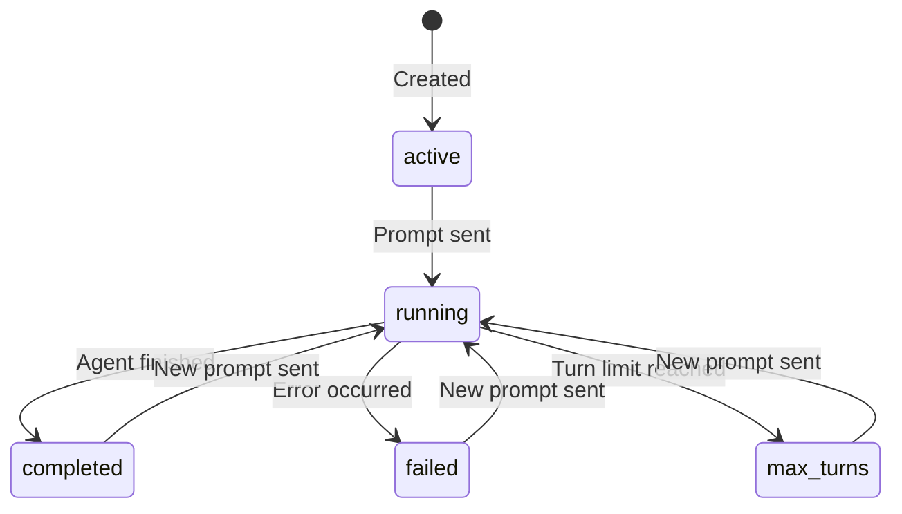

# Workflows

A workflow ties an agent to a specific execution context — it's where prompts are sent, responses are generated, and state is tracked.

---

## What is a Workflow?

A workflow combines:

| Property | Description |
|---|---|
| **Agent** | Which agent to use |
| **Model override** | Optionally use a different model than the agent's default |
| **Max turns** | Limit on tool-call rounds (prevents runaway loops) |
| **Output format** | `json` or `markdown` |
| **Infinite session** | Enable/disable automatic context compaction |
| **Skills** | Installed instruction modules |

Workflows persist their full state: messages, logs, usage stats, and status.

---

## Creating a Workflow

```bash
curl -X POST http://localhost:8000/api/workflows \
  -H "Authorization: Bearer $GITHUB_TOKEN" \
  -H "Content-Type: application/json" \
  -d '{
    "agent_id": "<AGENT_ID>",
    "max_turns": 10,
    "output_format": "markdown",
    "infinite_session": true
  }'
```

---

## Sending a Prompt

```bash
curl -X POST http://localhost:8000/api/workflows/<WF_ID>/prompt \
  -H "Authorization: Bearer $GITHUB_TOKEN" \
  -H "Content-Type: application/json" \
  -d '{"prompt": "Investigate the latest production alerts."}'
```

The API returns `201` immediately — execution happens asynchronously on a Celery worker. Use the [SSE stream](streaming.md) to follow progress.

---

## Workflow Lifecycle



---

## Halting a Workflow

Stop a running workflow:

```bash
curl -X POST http://localhost:8000/api/workflows/<WF_ID>/halt \
  -H "Authorization: Bearer $GITHUB_TOKEN"
```

---

## Infinite Sessions

Long-running agents can exhaust a model's context window. TBD Agents uses the Copilot SDK's **infinite session** feature to handle this automatically:

- At **80%** context fill → background compaction starts (SDK summarises older context)
- At **95%** → buffer exhaustion mode kicks in for aggressive compaction
- The agent continues working without interruption

This is enabled by default and can be toggled per workflow.
