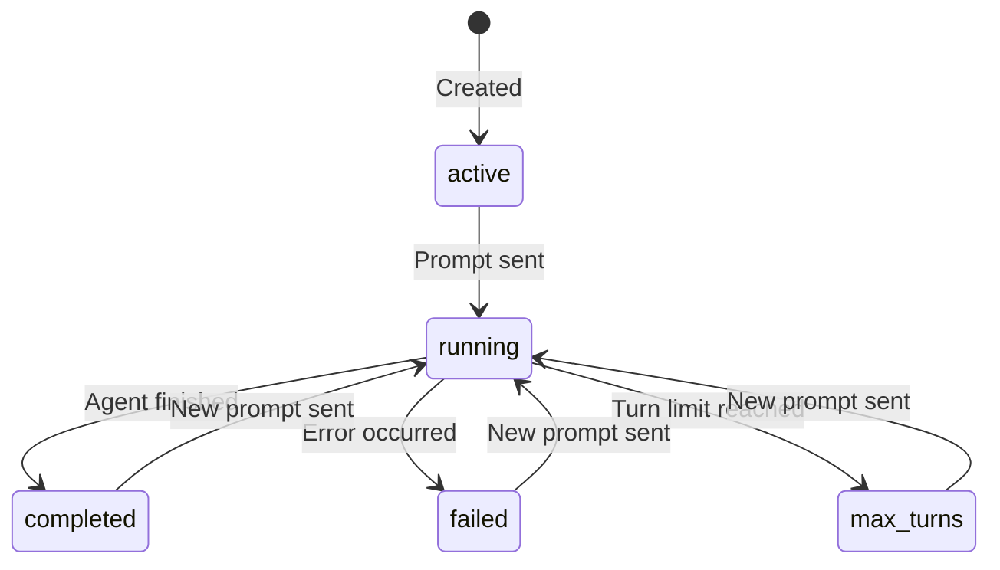

# Workflows

A workflow ties an agent to a specific execution context — it's where prompts are sent, responses are generated, and state is tracked.

---

## What is a Workflow?

A workflow combines:

| Property | Description |
|---|---|
| **Agent** | Which agent to use |
| **Model override** | Optionally use a different model than the agent's default |
| **Max turns** | Limit on tool-call rounds (prevents runaway loops) |
| **Output format** | `json` or `markdown` |
| **Infinite session** | Enable/disable automatic context compaction |
| **Caveman** | Enable terse responses + compressed injected context |
| **Skills** | Installed instruction modules |
| **Guardrails** | Prompt/request/output policies by ID or tag |
| **Reasoning effort** | Optional `low`, `medium`, or `high` model hint |
| **Memory controls** | Bypass memory, auto memory extraction, and infinite-session behaviour |
| **Repository context** | Optional repo URL, branch, and token name for checkout-enabled workflows |
| **Webhooks** | Success and error callbacks |

Workflows persist their full state: messages, logs, usage stats, and status.

---

## Creating a Workflow

```bash
curl -X POST http://localhost:8000/api/workflows \
  -H "Authorization: Bearer $GITHUB_TOKEN" \
  -H "Content-Type: application/json" \
  -d '{
    "agent_id": "<AGENT_ID>",
    "max_turns": 10,
    "output_format": "markdown",
    "reasoning_effort": "medium",
    "skill_tags": ["incident"],
    "guardrail_tags": ["safe-output"],
    "infinite_session": true,
    "bypass_memory": false,
    "auto_memory": true,
    "tsv_tool_results": false,
    "caveman": true,
    "repo_url": "https://github.com/example/service",
    "repo_branch": "main",
    "repo_token_name": "github-token",
    "webhook_url": "https://hooks.example.com/success",
    "error_webhook_url": "https://hooks.example.com/error"
  }'
```

The Flutter workflow form supports title, agent, model override, max turns, skills and skill tags, guardrails and guardrail tags, output format, reasoning effort, active/inactive status, infinite session, bypass/auto memory, TSV tool results, caveman mode, credential overrides, repository settings, and webhook URLs.

---

## Sending a Prompt

```bash
curl -X POST http://localhost:8000/api/workflows/<WF_ID>/prompt \
  -H "Authorization: Bearer $GITHUB_TOKEN" \
  -H "Content-Type: application/json" \
  -d '{"prompt": "Investigate the latest production alerts."}'
```

The API returns `201` immediately — execution happens asynchronously on a Celery worker. Use the [SSE stream](streaming.md) to follow progress.

---

## Workflow Lifecycle



---

## Halting a Workflow

Stop a running workflow:

```bash
curl -X POST http://localhost:8000/api/workflows/<WF_ID>/halt \
  -H "Authorization: Bearer $GITHUB_TOKEN"
```

---

## Infinite Sessions

Long-running agents can exhaust a model's context window. TBD Agents uses the Copilot SDK's **infinite session** feature to handle this automatically:

- At **80%** context fill → background compaction starts (SDK summarises older context)
- At **95%** → buffer exhaustion mode kicks in for aggressive compaction
- The agent continues working without interruption

This is enabled by default and can be toggled per workflow.

## Caveman Workflows

Enable `caveman` on a workflow to apply a native caveman mode inspired by
JuliusBrussee/caveman:

- final responses become terser to reduce output tokens
- injected memory/knowledge context is compressed before prompt assembly
- code, commands, paths, URLs, and identifiers are preserved verbatim

The workflow still keeps its normal output contract (`json` or `markdown`).
