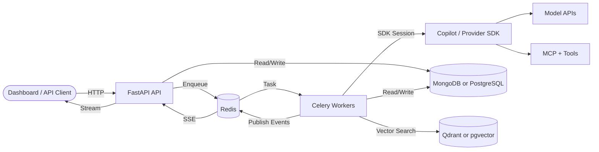

---
hide:
  - navigation
  - toc
---

# TBD Agents

<strong>Your agents. Your rules. Your infrastructure.</strong>

Build, control, schedule, and chat with custom AI agents over the web. TBD Agents provides a FastAPI API, Flutter dashboard, distributed workers, MCP/custom tools, guardrails, memory, knowledge retrieval, and MongoDB or PostgreSQL storage.

-   :rocket:{ .lg .middle } **Quick Start**

    ---

    Run the Docker Compose stack and open the dashboard.

    [:octicons-arrow-right-24: Quick Start](getting-started/quickstart.md)

-   :material-view-dashboard:{ .lg .middle } **Dashboard**

    ---

    Manage Agents, MCP Servers, Custom Tools, Skills, Knowledge, Guardrails, Tokens, Providers, Workflows, Scheduled Agents, Task Executions, Run Task, and Chat.

    [:octicons-arrow-right-24: Dashboard Guide](guide/dashboard.md)

-   :books:{ .lg .middle } **Guide**

    ---

    Learn about agents, workflows, tasks, memory, knowledge, tools, and import/export.

    [:octicons-arrow-right-24: Guide](guide/index.md)

-   :material-api:{ .lg .middle } **API Reference**

    ---

    Complete REST API endpoint reference for every resource.

    [:octicons-arrow-right-24: API Reference](api/index.md)

---

## Highlights

-   :house:{ .lg .middle } **Fully Self-Hosted**

    Runs on your infrastructure via Docker Compose. Store data in MongoDB + Qdrant or PostgreSQL + pgvector.

-   :zap:{ .lg .middle } **Real-Time Execution**

    Agents run on Celery workers and stream logs, messages, usage, and status over SSE.

-   :wrench:{ .lg .middle } **MCP + Custom Tools**

    Connect MCP servers, built-in tools, bundled plugins, and user Python tools with token mapping.

-   :material-shield-check:{ .lg .middle } **Guardrails**

    Prompt, request, and output guardrails enforce regex, schema, length, PII, and JSON policies.

-   :infinity:{ .lg .middle } **Memory + Knowledge**

    STM/LTM memory and tag/semantic knowledge retrieval are injected into agent context.

-   :material-calendar-clock:{ .lg .middle } **Scheduled Agents**

    Schedule recurring workflow prompts and review task executions from the dashboard or API.

---

## System at a Glance

[:octicons-mark-github-16: View on GitHub](https://github.com/naaico-tech/tbd-agents){ .md-button .md-button--primary }
[:material-rocket-launch: Quick Start](getting-started/quickstart.md){ .md-button }

