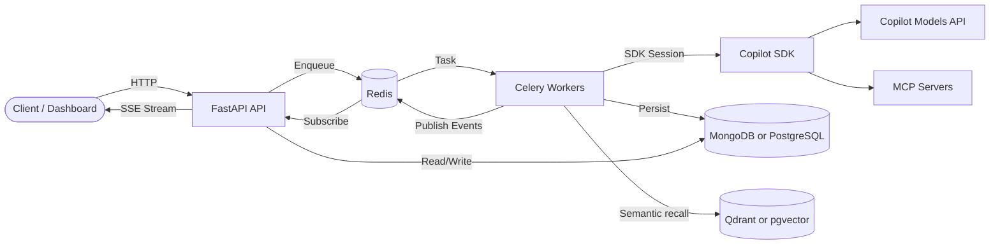

---
hide:
  - navigation
  - toc
---

# TBD Agents

<strong>Your agents. Your rules. Your infrastructure.</strong>

Build, control, and trigger custom AI agents over the web — no black boxes, no vendor lock-in. A clean API backed by the GitHub Copilot SDK that you run on your own infrastructure.

-   :rocket:{ .lg .middle } **Quick Start**

    ---

    Get running in under 5 minutes with Docker Compose.

    [:octicons-arrow-right-24: Quick Start](getting-started/quickstart.md)

-   :books:{ .lg .middle } **Guide**

    ---

    Learn about the dashboard, agents, MCP tools, skills, workflows, tasks, memory, and streaming.

    [:octicons-arrow-right-24: Guide](guide/index.md)

-   :building_construction:{ .lg .middle } **Architecture**

    ---

    System design, data model, request flow, and scaling strategy.

    [:octicons-arrow-right-24: Architecture](architecture/index.md)

-   :material-api:{ .lg .middle } **API Reference**

    ---

    Complete REST API endpoint reference for every resource.

    [:octicons-arrow-right-24: API Reference](api/index.md)

---

## Highlights

-   :house:{ .lg .middle } **Fully Self-Hosted**

    Runs on your infrastructure via Docker Compose. No SaaS dependency beyond GitHub Copilot billing.

-   :zap:{ .lg .middle } **Real-Time Streaming**

    SSE endpoint streams logs, messages, token-by-token responses, and usage metrics live to any client.

-   :material-cog-sync:{ .lg .middle } **Distributed Workers**

    Celery + Redis architecture scales agent execution horizontally. Add workers to handle load.

-   :wrench:{ .lg .middle } **MCP Tool Ecosystem**

    Connect Datadog, Jira, Notion, Slack, and hundreds more via the Model Context Protocol.

-   :infinity:{ .lg .middle } **Infinite Sessions**

    Automatic context compaction keeps long-running agents alive without hitting context limits.

-   :material-shield-check:{ .lg .middle } **Guardrails**

    Prompt and request guardrails enforce safety policies before agent execution begins.

-   :material-database-cog:{ .lg .middle } **Flexible Storage**

    Use MongoDB or PostgreSQL for documents, and Qdrant or pgvector for semantic retrieval.

---

## System at a Glance

---

[:octicons-mark-github-16: View on GitHub](https://github.com/naaico-tech/tbd-agents){ .md-button .md-button--primary }
[:material-rocket-launch: Quick Start](getting-started/quickstart.md){ .md-button }

Built by <a href="https://www.naaico.com"><strong>NAAICO</strong></a> — Navigate · Automate · Accelerate · Innovate · Create · Optimise

